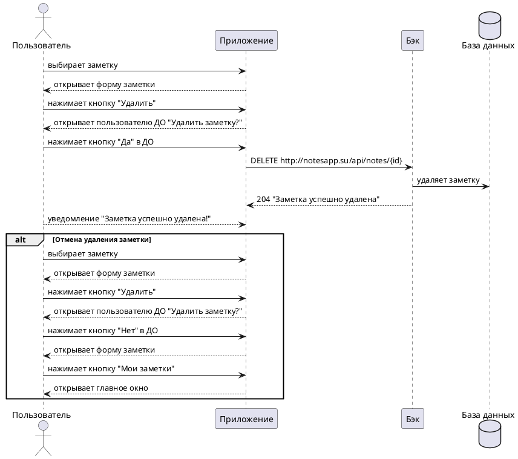

# Пользовательский сценарий «Удаление заметки» 

## Действующие лица:

1. Пользователь

2. Приложение

3. Бэк

4. База данных

## Предварительные условия

Пользователь должен находиться на главном экране.

## Выходные условия

Заметка удалена из системы. 

## Основной сценарий

1. Пользователь выбирает заметку, которую он хочет удалить, из списка заметок. 

2. Приложение открывает форму заметки. 

3. Пользователь нажимает кнопку **«Удалить»**. 

4. Приложение открывает пользователю диалоговое окно «Удалить заметку?».

4. Пользователь нажимает кнопку **«Да»** в диалоговом окне.

4. Приложение отправляет запрос `DELETE http://notesapp.su/api/notes/{id}` Бэку на удаление заметки. 

5. Бэк удаляет заметку из Базы данных. 

6. Бэк возвращает Приложению ответ 204 «Заметка успешно удалена». 

7. Приложение открывает пользователю уведомление «Заметка успешно удалена!».

## Альтернативный сценарий

1. Пользователь выбирает заметку, которую он хочет удалить, из списка заметок. 

2. Приложение открывает форму заметки. 

3. Пользователь нажимает кнопку **«Удалить»**. 

4. Приложение открывает пользователю диалоговое окно «Удалить заметку?».

4. Пользователь нажимает кнопку **«Нет»** в диалоговом окне.

2. Приложение открывает форму заметки. 

3. Пользователь нажимает кнопку **«Мои заметки»**. 

4. Приложение открывает окно со списком заметок. 

## Диаграмма последовательности 



??? note "Код диаграммы"
    ```plantuml
    @startuml
    actor Пользователь 
    participant Приложение
    participant Бэк
    database "База данных"

    Пользователь -> Приложение: выбирает заметку
    Пользователь <-- Приложение: открывает форму заметки
    Пользователь -> Приложение: нажимает кнопку "Удалить"
    Пользователь <-- Приложение: открывает пользователю ДО "Удалить заметку?"
    Пользователь -> Приложение: нажимает кнопку "Да" в ДО
    Приложение -> Бэк: DELETE http://notesapp.su/api/notes/{id}
    Бэк -> "База данных": удаляет заметку
    Приложение <-- Бэк: 204 "Заметка успешно удалена"
    Приложение <-- Пользователь: уведомление "Заметка успешно удалена!"

    alt Отмена удаления заметки
    Пользователь -> Приложение: выбирает заметку
    Пользователь <-- Приложение: открывает форму заметки
    Пользователь -> Приложение: нажимает кнопку "Удалить"
    Пользователь <-- Приложение: открывает пользователю ДО "Удалить заметку?"
    Пользователь -> Приложение: нажимает кнопку "Нет" в ДО
    Пользователь <-- Приложение: открывает форму заметки
    Пользователь -> Приложение: нажимает кнопку "Мои заметки"
    Пользователь <-- Приложение: открывает главное окно
    end alt
    @enduml
    ```